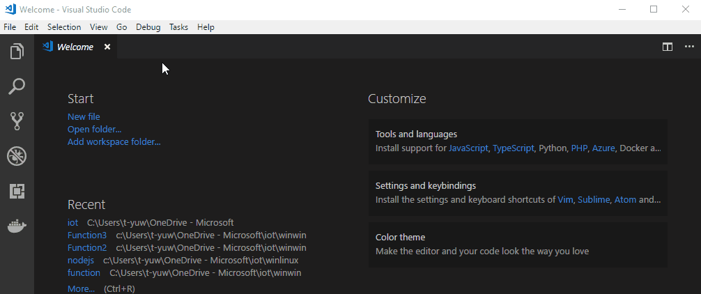
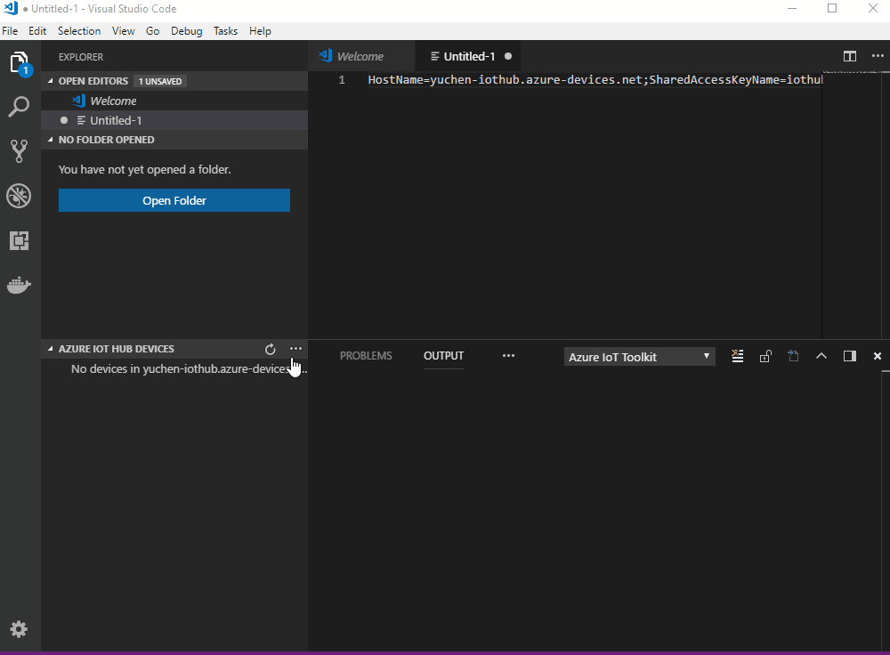
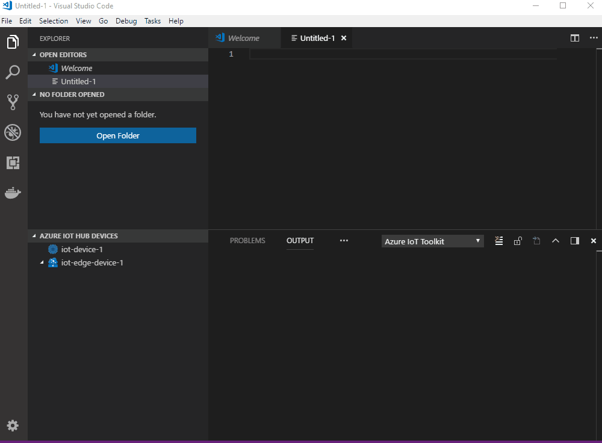
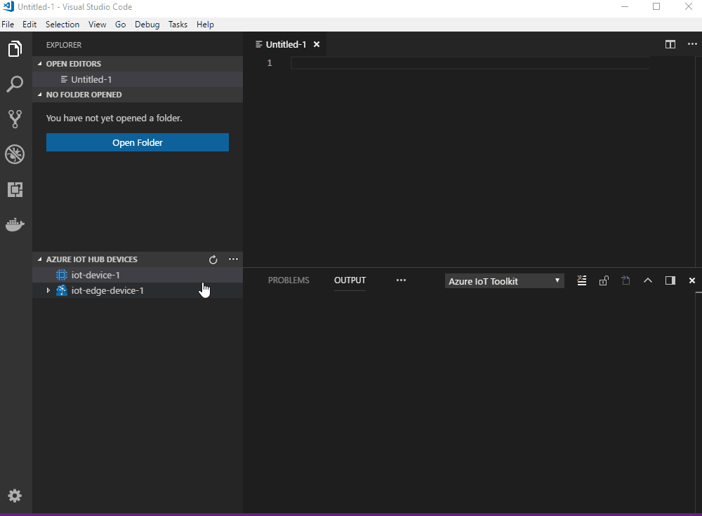

# Azure IoT Toolkit

[](https://gitter.im/Microsoft/azure-iot-toolkit?utm_source=badge&utm_medium=badge&utm_campaign=pr-badge&utm_content=badge) [](https://marketplace.visualstudio.com/items?itemName=vsciot-vscode.azure-iot-toolkit)

Interact with Azure IoT Hub, IoT Device Management, IoT Edge Management, IoT Hub Code Snippets.

- [Azure IoT Toolkit](#azure-iot-toolkit)
    - [Prerequisites](#prerequisites)
    - [Command Palette](#command-palette)
    - [IoT Hub management](#iot-hub-management)
        - [Create IoT Hub](#create-iot-hub)
        - [Select IoT Hub](#select-iot-hub)
        - [Copy IoT Hub Connection String](#copy-iot-hub-connection-string)
    - [Device management](#device-management)
        - [Create IoT device](#create-iot-device)
        - [Create Edge device](#create-edge-device)
        - [List devices](#list-devices)
        - [Get device info](#get-device-info)
        - [Copy Device Connection String](#copy-device-connection-string)
        - [Delete device](#delete-device)
    - [Interact with Azure IoT Hub](#interact-with-azure-iot-hub)
        - [Send D2C message to IoT Hub](#send-d2c-message-to-iot-hub)
        - [Monitor IoT Hub D2C message](#monitor-iot-hub-d2c-message)
        - [Send C2D message to device](#send-c2d-message-to-device)
        - [Monitor IoT Hub C2D message](#monitor-iot-hub-c2d-message)
        - [Edit Device Twin](#edit-device-twin)
        - [Invoke Direct Method](#invoke-direct-method)
    - [Interact with Azure IoT Edge](#interact-with-azure-iot-edge)
        - [List Edge Modules](#list-edge-modules)
        - [Create deployment for Edge device](#create-deployment-for-edge-device)
        - [Edit Module Twin](#edit-module-twin)
    - [Code Snippets](#code-snippets)
    - [Configuration](#configuration)
    - [Resources](#resources)
    - [Telemetry](#telemetry)

## Prerequisites
### Set IoT Hub Connection String
1. In Explorer of VS Code, click "Azure IoT Hub Devices" in the bottom left corner.

  

2. Click "Set IoT Hub Connection String" in context menu.

  

3. An input box will pop up, then enter your IoT Hub Connection String (It is one-time configuration, and please make sure it is **IoT Hub Connection String** not **Device Connection String**. The format is `HostName=<my-hub>.azure-devices.net;SharedAccessKeyName=<my-policy>;SharedAccessKey=<my-policy-key>`).

  

4. The device list will be shown.

  

**NOTE**: You could also go to **File** > **Preferences** > **Settings** (**Code** > **Preferences** > **Settings** on Mac), update the config of `azure-iot-toolkit.iotHubConnectionString` to change your IoT Hub Connection String.

[[back]](#azure-iot-toolkit)

### Sign in to Azure

Instead of copying and pasting to set IoT Hub Connection String, you could sign in to Azure to select IoT Hub from your Azure Subscription.

1. Click "Select IoT Hub" in context menu.

  

2. If you have not signed in to Azure, a pop-up will show to let you sign in to Azure.
3. After you sign in, your Azure Subscription list will be shown, then select an Azure Subscription.
4. Your IoT Hub list will be shown, then select an IoT Hub.
5. The device list will be shown.

[[back]](#azure-iot-toolkit)

## Command Palette
For any features listed above, you always have not only visual way (like right-click on something), but also CLI way using VSC command palette. Open it at **View > Command Palette...** and type **>Azure IoT**, you will have all the possible command shown in the auto-filling list.



[[back]](#azure-iot-toolkit)

## IoT Hub management
### Create IoT Hub
Command: **Azure IoT Hub: Create IoT Hub**

Click **... > Create IoT Hub** at **AZURE IOT HUB DEVICES** tab, then select subscription, resource group, deploy location and fill in the name of your IoT Hub. It will be created in a few minutes. you can see that your devices status become **No device in ...**.


[[back]](#azure-iot-toolkit)

### Select IoT Hub
Command: **Azure IoT Hub: Select IoT Hub**

Click **... > Select IoT Hub** at **AZURE IOT HUB DEVICES** tab,  then select subscription and available IoT Hub, it will be connected in a few seconds.


[[back]](#azure-iot-toolkit)

### Copy IoT Hub Connection String
Command: **Azure IoT Hub: Copy IoT Hub Connection String**

Click **... > Copy IoT Hub Connection String** at **AZURE IOT HUB DEVICES** tab, the connection string of your current IoT Hub will be copy to your clipboard.


[[back]](#azure-iot-toolkit)

## Device management

### Create IoT device
Command: **Azure IoT Hub: Create Device**

Click **... > Create Device** at **AZURE IOT HUB DEVICES** tab, enter device ID and the new device will be created in a few seconds.



[[back]](#azure-iot-toolkit)

### Create Edge device
Command: **Azure IoT Edge: Create IoT Edge Device**

Click **... > Create IoT Edge Device** at **AZURE IOT HUB DEVICES** tab, enter device ID and the new Edge device will be created in a few seconds.


[[back]](#azure-iot-toolkit)

### List devices
Command: **Azure IoT Hub: List Devices**

You can click refresh button at **AZURE IOT HUB DEVICES** tab to trigger **List Devices** command.


[[back]](#azure-iot-toolkit)

### Get device info
Command: **Azure IoT Hub: Get Device Info**

Right-click your device and select **Get Device Info**, results will be shown in **OUTPUT > Azure IoT Toolkit** view.


[[back]](#azure-iot-toolkit)

### Copy Device Connection String
Command: **Azure IoT Hub: Copy Device Connection String**

Right-click your device and select **Copy Device Connection String**, the connection string of the selected device will be copy to your clipboard.


[[back]](#azure-iot-toolkit)

### Delete device
Command: **Azure IoT Hub: Delete Device**

Right-click your device and select **Delete Device**, the selected device will be deleted in a few seconds.



[[back]](#azure-iot-toolkit)

## Interact with Azure IoT Hub

### Send D2C message to IoT Hub
Command: **Azure IoT Hub: Send D2C message to IoT Hub**

Right-click your device and select **Send D2C message to IoT Hub**, then enter the message, results will be shown in **OUTPUT > Azure IoT Toolkit** view.


[[back]](#azure-iot-toolkit)

### Monitor IoT Hub D2C message
Command: **Azure IoT Hub: Start Monitoring D2C Message**

Command: **Azure IoT Hub: Stop Monitoring D2C Message**

Right-click your device and select **Start Monitoring D2C Message**, the monitored messages will be shown in **OUTPUT > Azure IoT Toolkit** view.
To stop monitoring, right-click the **OUTPUT** view and select **Stop Monitoring D2C Message**.


[[back]](#azure-iot-toolkit)

### Send C2D message to device
Command: **Azure IoT Hub: Send C2D message to Device**

Right-click your device and select **Send C2D message to Device**, then enter the message, results will be shown in **OUTPUT > Azure IoT Toolkit** view.


[[back]](#azure-iot-toolkit)

### Monitor IoT Hub C2D message
Command: **Azure IoT Hub: Start Monitoring C2D Message**

Command: **Azure IoT Hub: Stop Monitoring C2D Message**

Right-click your device and select **Start Monitoring C2D Message**, the monitored messages will be shown in **OUTPUT > Azure IoT Toolkit** view.
To stop monitoring, right-click the **OUTPUT** view and select **Stop Monitoring C2D Message**.


[[back]](#azure-iot-toolkit)

### Edit Device Twin
Command: **Azure IoT Hub: Edit Device Twin**

Right-click your device and select **Edit Device Twin**, edit the device twin, then right-click in the editor and select **Update Device Twin** to take effect.



[[back]](#azure-iot-toolkit)

### Invoke Direct Method
Command: **Azure IoT Hub: Invoke Direct Method**

Right-click your device and select **Invoke Direct Method**, then enter the method name and payload, results will be shown in **OUTPUT > Azure IoT Toolkit** view.
You can follow the [tutorial](https://docs.microsoft.com/en-us/azure/iot-hub/quickstart-control-device-node) to learn how to create direct method on your IoT device.


[[back]](#azure-iot-toolkit)

## Interact with Azure IoT Edge

### List Edge Modules
Command: **No Command**

Right-click your edge device and select **Refresh** to trigger **List Edge Modules**. You can see the deployed modules and their status.


[[back]](#azure-iot-toolkit)

### Create deployment for Edge device
Command: **Azure IoT Edge: Create Deployment for IoT Edge Device**

Right-click your edge device and select **Create Deployment for IoT Edge Device**, then select Edge Deployment Manifest in the pop-up window, results will be shown in **OUTPUT > Azure IoT Toolkit** view. Wait for your device to start all your modules and refresh to see new modules.


[[back]](#azure-iot-toolkit)

### Edit Module Twin
Command: **Azure IoT Edge: Update Module Twin**

Right-click your edge module and select **Edit Module Twin**, edit the module twin, then right-click in the editor and select **Update Module Twin** to take effect. You can learn how to develop your own modules [here](https://docs.microsoft.com/en-us/azure/iot-edge).

**Note:** Azure IoT Edge system modules are read-only and cannot be modified. Changes can be submitted via deploying a configuration.


[[back]](#azure-iot-toolkit)


## Code Snippets

| Trigger | Content |
| ---- | ---- |
| iotSendD2CMessage | Send D2C message to IoT Hub |
| iotMonitorD2CMessage | Monitor D2C message for IoT Hub |
| iotSendC2DMessage | Send C2D message to device |
| iotMonitorC2DMessage | Monitor C2D message from IoT Hub |
| iotCallDirectMethods | Send direct methods to device |
| iotReceiveDirectMethods | Receive direct methods from IoT Hub |


> After code snippet is created, you need to install corresponding npm package (e.g. [azure-iot-device-mqtt](https://www.npmjs.com/package/azure-iot-device-mqtt)) to run the code snippet.
> If you want to 'Run Code' directly, you need to install [Code Runner](https://marketplace.visualstudio.com/items?itemName=formulahendry.code-runner).

[[back]](#azure-iot-toolkit)

## Configuration

IoT Hub Connection String:
```json
{
    "azure-iot-toolkit.iotHubConnectionString": "HostName=<my-hub>.azure-devices.net;SharedAccessKeyName=<my-policy>;SharedAccessKey=<my-policy-key>"
}
```

Device Connection String:
```json
{
    "azure-iot-toolkit.deviceConnectionString": "HostName=<my-hub>.azure-devices.net;DeviceId=<known-device-id>;SharedAccessKey=<known-device-key>"
}
```

IoT Hub Consumer Group (default is `"$Default"`):
```json
{
    "azure-iot-toolkit.iotHubConsumerGroup": "$Default"
}
```

Whether to show verbose info when monitoring messages (default is `false`):
```json
{
    "azure-iot-toolkit.showVerboseMessage": false
}
```

Whether to stringify device-to-cloud messages (default is `false`):
```json
{ 
    "azure-iot-toolkit.iotHubD2CMessageStringify": false
}
```

Whether to show IoT Hub info when IoT Hub Connection String is not set (default is `true`):
```json
{ 
    "azure-iot-toolkit.showIoTHubInfo": true
}
```

[[back]](#azure-iot-toolkit)

## Resources
- [Channel 9 video: Walkthrough of Azure IoT Toolkit extension](https://channel9.msdn.com/Shows/Internet-of-Things-Show/Azure-IoT-Toolkit-extension-for-Visual-Studio-Code)
- [Handy Tool When You Develop With Azure IoT](https://blogs.msdn.microsoft.com/iotdev/2017/09/01/handy-tool-when-you-develop-with-azure-iot/)

[[back]](#azure-iot-toolkit)

## Telemetry
This project collects usage data and sends it to Microsoft to help improve our products and services. Read our [privacy statement](http://go.microsoft.com/fwlink/?LinkId=521839) to learn more. 
If you don’t wish to send usage data to Microsoft, you can set the `telemetry.enableTelemetry` setting to `false`. Learn more in our [FAQ](https://code.visualstudio.com/docs/supporting/faq#_how-to-disable-telemetry-reporting).
